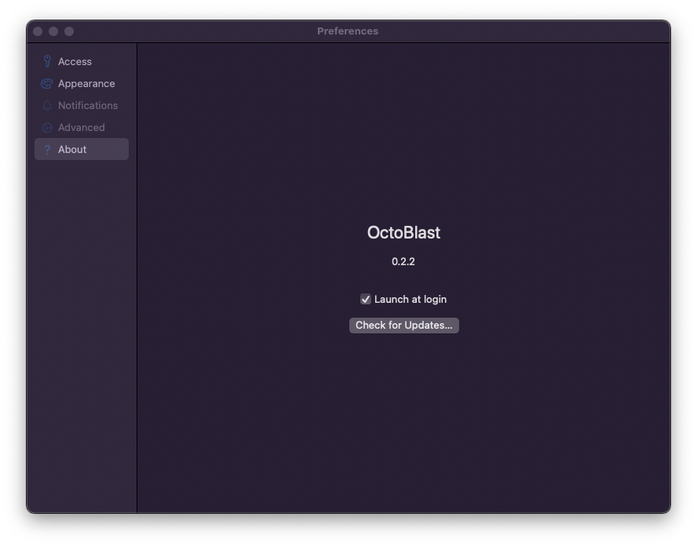

# OctoBlast

Gently notifies you about <i>important</i> GitHub notifications

## Install

Grab the latest release [here](https://github.com/jbw/OctoBlast/releases/latest).

## Setup

  

### Personal access token

Head to preferences, and pop in your new GitHub personal token from [your developer settings](https://github.com/settings/tokens) with permissions `notifications` and `read:user`.

### OAuth

Simply press 'Sign In' button and follow the instructions.

## New notifications indicator

Icon color indicates you have new notifications.

  
  

## Customization

You can change the color of the status menu icon in Preferences -> Appearance.

  

### Preferences

Select launch on login and check for updates.

  

[license-badge]: https://img.shields.io/github/license/jbw/OctoBlast?color=lightgray&style=flat-square
[license]: https://github.com/jbw/OctoBlast/blob/main/LICENSE
