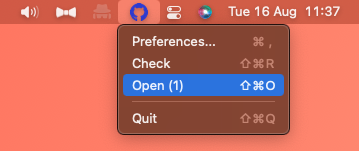

# OctoBlast

Gently notifies you about <i>important</i> GitHub notifications

  

## Setup

### Personal access token
Head to preferences, and pop in your a new GitHub personal token from [your developer settings](https://github.com/settings/tokens) with permissions `notifications` and `read:user`. 

## Example

  

## Download

https://jbw.codes/OctoBlast/
